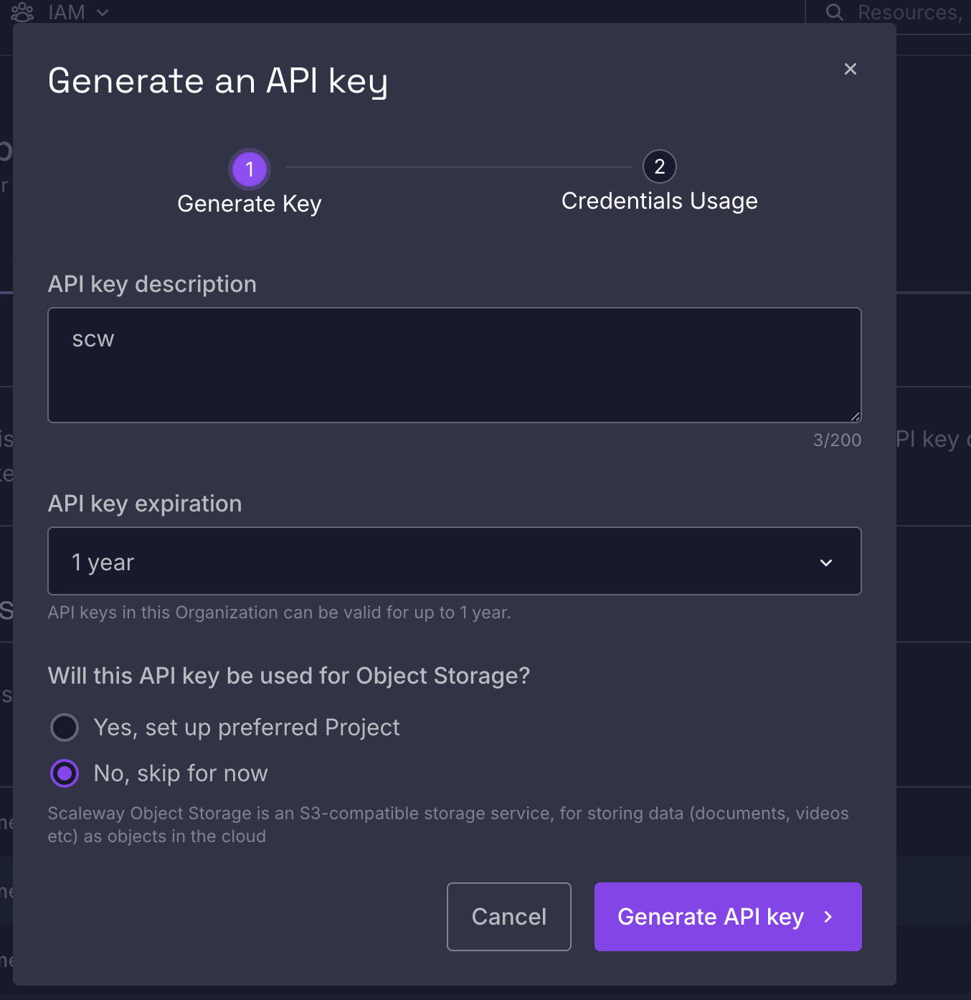

# freeagent-connector

This "connector" was built to give Claude access to my
[FreeAgent](https://www.freeagent.com/) data. At this point it is an internal tool, however
I tried to write clearly and for the general public in case it would be useful for others.
If you need help to set up, adapt, or if you'd like a similar tool for your business,
[ask a question](../../discussions).

Inspired by [samaxbytez/freeagent-mcp](https://github.com/samaxbytez/freeagent-mcp). Although
initially I thought I'd be developing on top of it, I decided to start from scratch using
[FastMCP](https://gofastmcp.com) and Python.

- **WIP** — "work in progress". A term used by developers, used throughout this readme to
  mark functionality that is not yet available. Equivalent to "coming soon".

## What's available

|                                                                               | Status        |
| ----------------------------------------------------------------------------- | ------------- |
| **A FreeAgent command-line tool** — read your accounting data from a terminal | **Works now** |
| **A Claude connector** — ask Claude questions about your books                | **WIP**       |

They share the same FreeAgent setup, so following the steps below gets you the working half
today.

## How it works

This project is a small server that sits between FreeAgent and Claude (or another AI
provider) and acts as a translator. Once it's connected, you can ask Claude things like
_"which bank transactions from March are still unexplained?"_ and Claude can go and look.

The technical name for this kind of translator is an **MCP server** — MCP being a shared
standard for connecting AI assistants to outside tools. In Claude, these show up as
**connectors**. You don't need to know anything more than that to use it.

Additional reading:

[What is MCP?](https://modelcontextprotocol.io/docs/2026-07-28/getting-started/intro)
explains it in plain terms (think "a USB-C port for AI").

[Get started with custom connectors](https://support.claude.com/en/articles/11175166-get-started-with-custom-connectors-using-remote-mcp).

# Setup

Written assuming you can follow a terminal, but haven't necessarily built a Python service
before.

## Get FreeAgent credentials

This is the one part of setup shared by both the command-line tool and (later) the
connector.

Before connecting to FreeAgent you need to register an "app". That gives you two strings —
a **client ID** and a **client secret** — which together identify this server to FreeAgent.
This way one "app" can be installed on different FreeAgent organisations, and for example
if an "app" is found to be malicious FreeAgent can uninstall it from all the organisations
at once. Unfortunately this registration is required even if you only want to connect to
your own account.

1. Go to the [FreeAgent Developer Dashboard](https://dev.freeagent.com/) and sign in.
2. Create an app.
3. Set the **OAuth redirect URI** to `http://localhost:8723/callback`. This is where
   FreeAgent sends your browser back to after you approve access, so it has to match
   exactly — a trailing slash will break it.

   That address is the one the command-line tool uses, because the browser comes back to
   your own machine. The connector, once it's deployed, is reached at a public web address
   instead, and so needs its own redirect URI registered —
   `<the container's URL>/auth/callback`. Nothing to do about that now; the
   [deployment runbook](docs/plans/freeagent-mcp-remote-deployment.md) covers it at the
   point where it matters. It's only worth knowing so that seeing two different addresses
   later doesn't look like one of them is a mistake.

4. Duplicate `.env.example` into `.env` if you haven't already. That file is not checked
   into git, thanks to [`.gitignore`](.gitignore). Copy the OAuth identifier and secret
   into it as `FREEAGENT_CLIENT_ID` and `FREEAGENT_CLIENT_SECRET`.

# The command-line tool

This works today. It reads any part of your FreeAgent account from the terminal, handling
the login for you.

## 1. Install

The only thing you need installed first is [uv](https://docs.astral.sh/uv/), a tool that
manages Python projects. It fetches the right version of Python for you, so you don't need
Python installed already and don't need to know anything about virtual environments.

On a Mac, with [Homebrew](https://brew.sh/):

```bash
brew install uv
uv --version    # check it worked
```

Other platforms, and other ways to install it, are covered in
[uv's installation guide](https://docs.astral.sh/uv/getting-started/installation/).

Then:

```bash
git clone https://github.com/kivistudio/freeagent-connector.git
cd freeagent-connector
uv sync                 # creates .venv, installs everything, fetches Python 3.14
cp .env.example .env    # then add the credentials from the step above
```

`uv sync` takes a minute the first time and is near-instant afterwards.

`uv run <command>` runs things inside that environment, which is why every command below
starts with it.

## 2. Authorise

```bash
uv run scripts/fa_auth.py
```

A browser opens, you approve access, and it writes a token back to `.env`. FreeAgent's
access tokens last an hour, but a refresh token is saved alongside and used automatically,
so this is genuinely a one-time step.

> **Sandbox.** FreeAgent offers a free sandbox at
> [signup.sandbox.freeagent.com](https://signup.sandbox.freeagent.com/signup) — a throwaway
> company you can safely write to. It needs its own signup and its own app registration;
> sandbox credentials don't work against production. Point at it by setting
> `FREEAGENT_API_BASE_URL=https://api.sandbox.freeagent.com/v2`, and the login endpoints
> follow automatically so the two can't get crossed. Worth doing before anything that
> writes; not worth it for reading, since a sandbox has none of your actual data.

## Calling endpoints

FreeAgent's data is organised into "endpoints" — `/company`, `/invoices`,
`/bank_accounts` and so on. The [FreeAgent API docs](https://dev.freeagent.com/docs/) list
them all. You ask for one like this:

```bash
uv run fastmcp call scripts/freeagent_api_caller.py request path=/company
```

### Some things to try

All of these are read-only and safe.

```bash
# Your company profile: year end dates, VAT registration, company type
uv run fastmcp call scripts/freeagent_api_caller.py request path=/company

# Bank accounts, including how many transactions are still unexplained
uv run fastmcp call scripts/freeagent_api_caller.py request path=/bank_accounts

# Trial balance — every nominal account and its total
uv run fastmcp call scripts/freeagent_api_caller.py request \
    path=/accounting/trial_balance/summary

# One contact, to see what fields a contact has
uv run fastmcp call scripts/freeagent_api_caller.py request \
    --input-json '{"path": "/contacts", "params": {"per_page": "1"}}'

# Click around in a browser instead
uv run fastmcp dev inspector scripts/freeagent_api_caller.py
```

Simple arguments go as `key=value`. Nested ones — `params` and `body` — need
`--input-json`, which can carry the whole call.

### Keeping the output manageable

A list endpoint can return thousands of records. Two ways to trim it, and they combine:

- **`per_page=1`** limits how many _records_ come back. Usually what you want — one real
  record shows you the actual formats values come in.
- **`shape_only=true`** field names and types, no values. Useful for learning API shape during development.

```bash
uv run fastmcp call scripts/freeagent_api_caller.py request path=/invoices shape_only=true
```

### Other options

| Argument        | What it does                                                         |
| --------------- | -------------------------------------------------------------------- |
| `path`          | Which endpoint to call. The only required one.                       |
| `method`        | `GET` by default.                                                    |
| `params`        | Query options, e.g. `{"view": "unexplained"}`. Needs `--input-json`. |
| `show_headers`  | Adds the true record count and paging links to the result.           |
| `confirm_write` | Required before anything that changes data.                          |

Changing data (`POST`, `PUT`, `DELETE`) needs `confirm_write=true`. That's deliberate
friction — these are your real accounting records. Use the sandbox for those.

# Deploying the read-only connector

To use a connector inside Claude, the server has to live at a **public web address**. Claude
reaches a connector from Anthropic's own servers, not from your computer, so a program
running only on your machine can't be seen. "Deploying" just means putting the server
somewhere on the internet that Claude can reach.

What you can deploy today is the **read-only** version. It can look up anything in your
FreeAgent account but cannot create, change or delete anything — which is what makes it safe
to expose as a single general "read any endpoint" tool, rather than waiting for the narrow
per-task tools of the full connector.

These steps use [Scaleway](https://www.scaleway.com/), a European cloud host, because that's
what this project was set up for. Another host that runs containers would also work, but the
commands below are Scaleway-specific.

## Setup Scaleway

- [Docker](https://www.docker.com/products/docker-desktop/) installed and **running** — open
  Docker Desktop and wait for it to finish starting.

- A [Scaleway](https://console.scaleway.com/) account and the
  [Scaleway CLI installed](https://www.scaleway.com/en/docs/scaleway-cli/quickstart/). For
  example on a Mac with Homebrew:

  ```bash
  brew install scw
  ```

- A [Scaleway API key](https://www.scaleway.com/en/docs/iam/how-to/create-api-keys/) to log
  the CLI in with. Generate one from the console → IAM → API keys; Object Storage isn't
  needed, so you can skip that step:

  

  The screen that follows hands you a ready-made `scw init` command — paste it into your
  terminal, and keep the secret key somewhere safe, because the console won't show it again.
  During `scw init` the defaults are fine; the one prompt worth declining is the offer to add
  an SSH key (that's only for logging into virtual-machine Instances, which this project
  doesn't use).

  `scw init` doesn't only log you in — it writes a **profile**: a small settings file on your
  own computer (`~/.config/scw/config.yaml`) that every `scw` command reads, so you don't
  retype your key or your project each time. It looks like this:

  ```yaml
  active_profile: newprofile
  profiles:
    newprofile:
      access_key: SCWXXXXXXXXXXXXXXXXX
      secret_key: xxxxxxxx-xxxx-xxxx-xxxx-xxxxxxxxxxxx
      default_organization_id: 00000000-0000-0000-0000-000000000000
      default_project_id: 00000000-0000-0000-0000-000000000000
      default_region: fr-par
      default_zone: fr-par-1
  ```

  A **profile** is just a named set of those settings — your API key, and which organisation,
  project and region commands act on by default. You can keep more than one (a work account
  and a personal one, say) and switch between them; `active_profile` names the one in use.
  Because it lives only on your machine, you won't find "the profile" anywhere in the Scaleway
  console.

## Steps

`<LIKE_THIS>` marks a value you fill in as you go; earlier steps hand you the later ones.

1. **Make a place to store the built container.**

   ```bash
   scw registry namespace create name=<PROJECT_NAME> region=fr-par
   ```

   A **registry** is cloud storage for your containers; a **namespace** is a named folder inside
   it. This command just makes the empty folder —
   nothing is uploaded yet. You can see it afterwards in the console under **Container
   Registry**.

2. **Build the container and upload it.**

   ```bash
   docker build --platform linux/amd64 -t rg.fr-par.scw.cloud/<PROJECT_NAME>/server:latest .
   scw registry login region=fr-par
   docker push rg.fr-par.scw.cloud/freeagent-mcp-remote/server:latest
   ```

   These run in order: `docker build` packages the project into a container **image** on your
   own machine; `scw registry login` signs in to your registry — with `<YOUR_SCALEWAY_SECRET_KEY>`,
   the same secret key from `scw init`, as the password; `docker push` uploads the image into
   the namespace you made in step 1, where it then shows up in the console under **Container
   Registry**.

   `--platform linux/amd64` builds the container for the kind of chip Scaleway's servers
   use rather than your Mac's — see [Serverless containers, and which chip they run
   on](#serverless-containers-and-which-chip-they-run-on) for why it matters. One
   consequence: on an Apple Silicon Mac this image will **not** run on your own machine, so
   this is not the version to test locally. If you want to check the container works before
   deploying, build it once **without** `--platform` (which builds it for your own machine),
   run and check that version locally, then build again **with** `--platform linux/amd64`
   for the push above.

3. **Create the running service, and note the address it gives you.**

   ```bash
   scw container namespace create name=freeagent-mcp-remote region=fr-par
   # note the ID it prints, as <NAMESPACE_ID>
   ```

   This command creates a **Serverless Containers namespace** —
   the space that _runs_ services, which is a different thing from the registry that _stores_
   images.

   ```bash
   scw container container create \
     name=freeagent-mcp-remote \
     namespace-id=<NAMESPACE_ID> \
     registry-image=rg.fr-par.scw.cloud/freeagent-mcp-remote/server:latest \
     port=8080 min-scale=0 max-scale=1 memory-limit=256 cpu-limit=140 \
     privacy=public region=fr-par
   # note the ID it prints, as <CONTAINER_ID>, and the public URL, as <CONTAINER_URL>
   ```

   This creates the running container itself from the image you pushed, and prints its public web address.

   Afterwards you'll find it in the console under **Containers**.

   `min-scale=0` lets the service sleep when unused, so it costs nothing while idle; it wakes
   on the next request. The first request after a nap is slower, and you may have to approve
   access again (see step 8).

4. **Tell FreeAgent where to send you back after you approve access.**

   In the [FreeAgent Developer Dashboard](https://dev.freeagent.com/), open your app and add
   this as an **OAuth redirect URI**:

   ```
   <CONTAINER_URL>/auth/callback
   ```

   This is the connector's own address. It's separate from the `http://localhost:8723/callback`
   you set for the command-line tool in setup — both can be registered at the same time.

5. **Give the service its settings.**

   ```bash
   scw container container update <CONTAINER_ID> region=fr-par \
     environment-variables.PORT=8080 \
     environment-variables.PUBLIC_BASE_URL=<CONTAINER_URL> \
     secret-environment-variables.FREEAGENT_CLIENT_ID=<YOUR_CLIENT_ID> \
     secret-environment-variables.FREEAGENT_CLIENT_SECRET=<YOUR_CLIENT_SECRET>
   ```

   The client ID and secret are the same ones in your `.env`. Do **not** set
   `FREEAGENT_DEV_TOKEN` here — it's a local-only shortcut, and on a public server it would be
   a standing security hole.

6. **Deploy.**

   ```bash
   scw container container deploy <CONTAINER_ID> region=fr-par
   ```

   Up to now you've only _described_ the container; this applies everything you've set and
   starts it (or restarts it with the new settings). Run it again after any later change to
   the image or the settings.

7. **Check it's alive.** Open `<CONTAINER_URL>/health` in a browser — you should see
   `{"status": "healthy", ...}`.

8. **Add it to Claude.** In Claude: Settings → Connectors → Add custom connector, and enter
   `<CONTAINER_URL>/mcp` as the address. Leave the optional OAuth fields blank. Claude walks
   you through approving access, which finishes on FreeAgent's own consent screen; approve
   there and you're connected. There is no token to copy anywhere.

If the connector stops responding after a quiet spell, that's the sleeping behaviour from
step 3 — reconnecting in Claude wakes it and re-approves access.

The [deployment runbook](docs/plans/freeagent-mcp-remote-deployment.md) is the same process
with more technical detail, including how to redeploy after a code change.

## Gotchas

### A note on projects

When you open the Scaleway console you land inside a **project** — a named space that holds
your resources. Scaleway starts you with one, so an empty "Resources overview" just means
nothing has been created in it yet. Everything the steps below create — the registry, the
container — appears in this project once it exists.

Two things so the console doesn't mislead you:

- **`scw init` decides which project your commands act on.** When it asks for a default
  project, pick the same one you're looking at in the console — otherwise your resources land
  in a different project than the one you're watching. The **Copy ID** button next to the
  project's name gives you its ID if you need to check or set it.
- **Ignore the "Create Instance" button.** An _Instance_ is a full virtual machine, which this
  project doesn't need. The connector runs as a lighter _Serverless Container_, created by the
  commands below — you never click "Create Instance".

### "namespace" means two things

Scaleway uses "namespace" for two separate things, and this deploy touches both:

- a **Container Registry namespace** — storage that holds your built image, and
- a **Serverless Containers namespace** — the space that holds the running service.

Creating the Serverless Containers namespace **automatically creates a matching Container
Registry namespace** in the same project, so you don't create the registry one separately.

**you have to build and push the image _before_ you can
finish creating the container.** If you create the namespace in the console, it drops you
straight onto a "Deploy a Container" screen — but the **Image** field there stays empty and
greyed out until an image has actually been pushed to the registry. So if you land on that
screen with nothing to select, that's expected, not a bug: leave it, do the build and push
first, then come back and the image will be there to choose.

The steps below are the command-line version, which does registry-create, build, push and
container-create in a clear order. The console does the same things — just with the "deploy the
container" screen appearing earlier than the image it needs.

# [WIP] The Claude connector

Not ready yet. When it is, you'll be able to add this to Claude as a connector and ask
questions in plain language rather than calling endpoints yourself:

- Work through unexplained bank transactions and suggest how to categorise them
- Pull up the profit & loss, balance sheet or trial balance for a period
- Look at journal entries, or post corrections
- Prepare figures for VAT returns and corporation tax
- Review payroll and PAYE figures
- Think through the salary-versus-dividends split using your actual profit
- Track time, tasks and projects

The difference from the command-line tool is that the connector exposes each of these as a
separate, narrow capability rather than one general "call anything" command.

A simpler, **read-only** version of the connector can be deployed and used in Claude today —
see [Deploying the read-only connector](#deploying-the-read-only-connector) below. The full
version described above isn't ready yet.

# For developers

## Checks on commit

A [git hook](https://git-scm.com/book/en/v2/Customizing-Git-Git-Hooks) runs checks
automatically every time you commit. Enable it once:

```bash
git config core.hooksPath .githooks
```

The whole suite takes about two seconds. If something fails, the commit stops and you get
the output.

**To commit anyway**, use git's built-in bypass:

```bash
git commit --no-verify -m "..."
```

The hook also refuses outright to commit `.env`, which holds a live FreeAgent secret and
access token.

## Working on the connector

```bash
# What tools does the server expose, and what do their inputs look like?
uv run fastmcp inspect src/server.py:create_server

# Click through it in a browser
uv run fastmcp dev inspector src/server.py:create_server
```

Note the `:create_server` at the end — these commands need the file _and_ the name of the
function inside it that builds the server, not just the filename.

**FreeAgent's documentation has gaps, contradictions and at least two copy-paste errors**,
so the connector's tools are designed against real API responses rather than against the
docs. That's what the command-line tool above is for. `scripts/freeagent_api_caller.py` is local
only and must never be deployed; there's a test that fails if it ever reaches the deployed
server.

# Learning

## Caches

Three directories appear once you've run the tools. All are generated, gitignored, and
never inputs to the program — deleting any of them costs nothing but a slower next run.

- **`.mypy_cache/`** — what mypy learned about each file's types, so re-checking an
  unchanged file is a cache read rather than a fresh analysis. The one that matters most:
  without it, every run re-analyses all your dependencies' type information.
- **`.pytest_cache/`** — which tests failed last time. This is what powers `pytest --lf`
  (last-failed) and `--ff` (failed-first), so you can iterate on just the broken tests.
- **`.ruff_cache/`** — per-file lint results. Ruff is fast enough that you'd barely notice
  this one missing.

If anything ever behaves strangely, `rm -rf .mypy_cache .pytest_cache .ruff_cache` is a
safe reset.

## Serverless containers, and which chip they run on

Scaleway runs the connector as a _serverless container_: you hand it the built image, and
it runs the container only while a request is being handled, then puts it back to sleep
when nothing is using it (that is what `min-scale=0` in step 3 of the deploy does). You
never rent or look after a server that sits running all day — you pay for the moments it is
actually working, and the first request after a nap is a little slower while it wakes.

The catch is which computer that container runs on. A container image holds real compiled
programs — the language runtime and its libraries — and each is built for one specific kind
of computer chip. Two matter here:

- **Apple Silicon** — the M1/M2/M3 chip in most recent Macs, called _arm64_.
- **Intel/AMD chips** — called _amd64_, which is what Scaleway's servers use.

An image built for one chip will not run on the other. Build on an Apple Silicon Mac with
no special flag and you get an _arm64_ image; push that to Scaleway, which is _amd64_, and
it will not start. The `--platform linux/amd64` flag on `docker build` is what fixes this:
it builds the image for Scaleway's chip rather than your Mac's. Your Mac does the build by
translating as it goes, so it is a little slower, but the result runs on Scaleway. The same
rule in reverse means that amd64 image will not run on an Apple Silicon Mac — which is fine,
because it is built for Scaleway, not your laptop. If your own computer already has an
Intel/AMD chip, the flag changes nothing, since you are building for that chip anyway.

# If you get stuck

I built this for my own company's books, and wrote it up properly in case it's useful to
someone else.

If you're trying to set up something like this and it isn't going well, I do this kind of
work professionally and I'm happy to talk. <!-- TODO: name + how to get in touch -->

If you've found a bug or something here is wrong, an issue is welcome.

# Glossary

Plain-English definitions of the outside tools this project relies on. You don't need to
understand these to follow the steps above — they're here in case a name is unfamiliar.

**Docker** — a tool that packages a program together with everything it needs to run (the
right language version, the libraries, the settings) into one self-contained bundle called a
_container_. The point is that the bundle behaves the same on your laptop as on a cloud
server, so "it works on my machine" stops being a gamble. Here it's used to build the
connector into a container that Scaleway then runs.

**Container** — the self-contained bundle Docker produces: the app plus its whole
environment, kept separate from whatever else is on the machine. It starts, stops and moves
around as a single unit.

**Scaleway** — a European cloud hosting company. "The cloud" just means someone else's
computers that you rent over the internet rather than running your own. This project runs the
connector's container on Scaleway so it has a permanent public web address for Claude to
reach.

**Container registry** — cloud storage specifically for containers, a little like a photo
library but for built app bundles. You upload ("push") your container to the registry, and
the cloud pulls it from there when it runs it. A **namespace** is a named folder inside the
registry that keeps one project's containers together.
